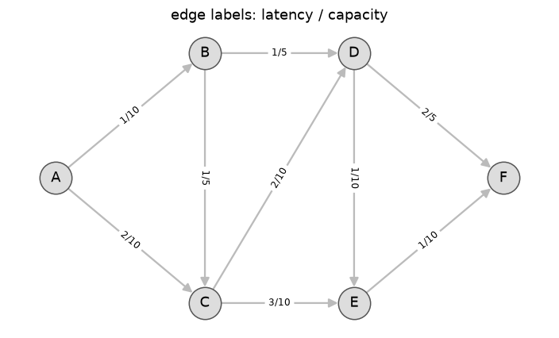
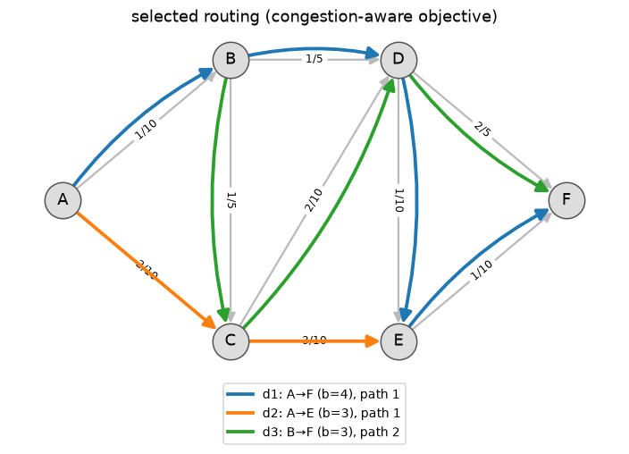
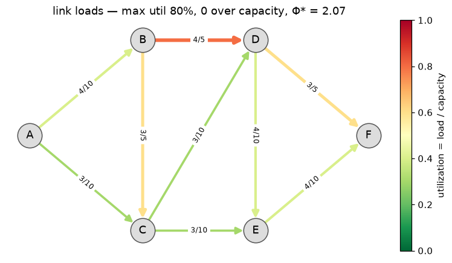
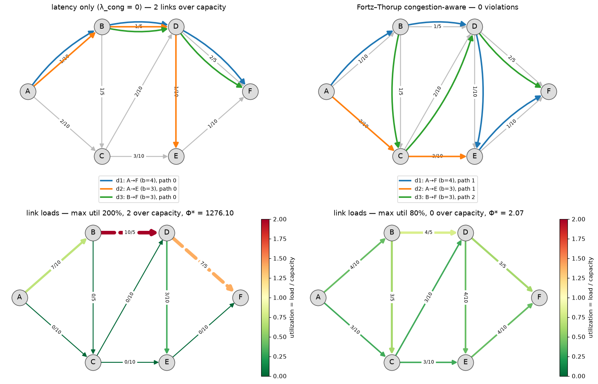
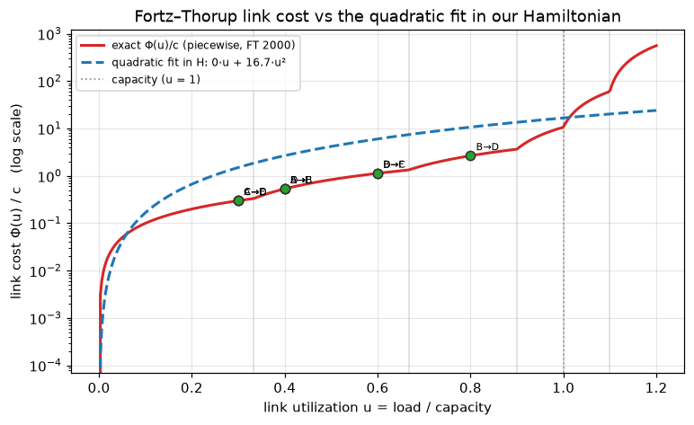
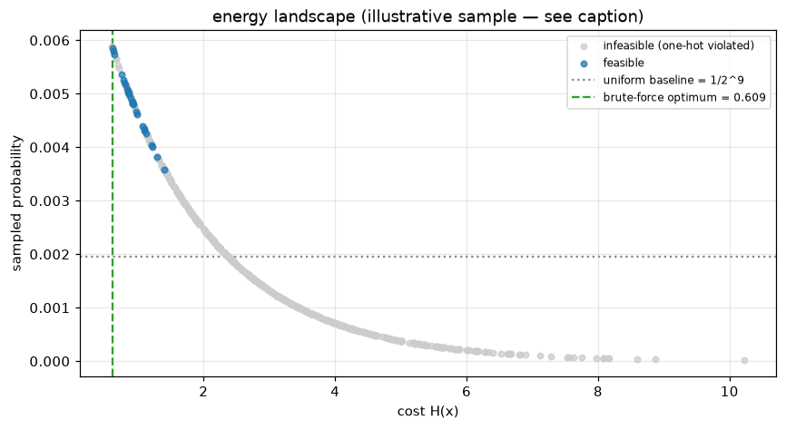
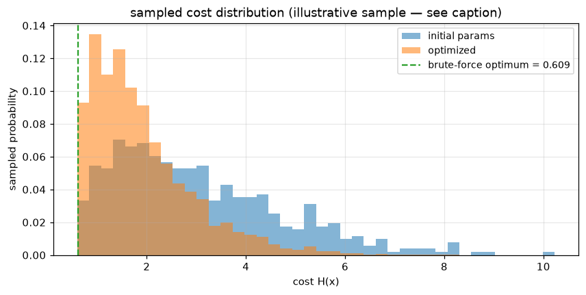

# Presentation visuals

Everything the `feature/presentation-viz` branch adds: seven matplotlib figures in
`routing_qaoa/viz.py`, an interactive dashboard, and the notebook cells that place them in the demo.

All figures below are reproducible offline — no Classiq cloud, no QAOA run:

```bash
python scripts/render_figures.py       # regenerates docs/figures/*.png
python scripts/build_dashboard_data.py # regenerates the dashboard + its JSON
```

The instance is the 6-router toy network from `qaoa_routing.ipynb`: 9 directed links, 3 demands,
K=3 candidate paths each, so N = 9 qubits. Demand `d1` carries priority π = 3 (premium class).

---

## 1. The network views

The three original views, each taking an optional `pos` layout and an `ax`, so they compose into
subplot grids.

### `plot_network` — topology

Edge labels are `latency/capacity`. The instance is adversarial on purpose: every demand's
latency-shortest path funnels through the thin B→D link (c=5).



### `plot_routing` — the chosen path per demand

One color per demand, arcs fanned apart so paths sharing a link stay legible. A demand whose
one-hot constraint is violated appears in the legend as "unsatisfied" rather than vanishing.

Note the priority at work: `d1` (blue, π = 3) wins the contested B→D link and `d3` (green) detours
via B→C→D. At neutral priority that decision flips.



### `plot_link_utilization` — load against capacity

Links colored by u = load/capacity with a colorbar, labeled `load/capacity`, over-capacity links
dashed. Title carries max utilization, violation count, and Φ*.



---

## 2. What the congestion term buys

`plot_solution_comparison(instance, {label: solution, ...})` — the headline figure. Routings on
top, utilization below, one column per objective.

Two details make it honest rather than merely pretty. Both columns are decoded under the **same**
coefficient set, so their costs are directly comparable; and both utilization panels share **one**
color scale, computed across all panels. Without that shared scale each panel normalizes to its own
maximum, and the same red means 200% in one column and 100% in the next — which quietly reverses
the conclusion the figure is meant to support.



| objective | max util | violations | Φ* |
| --- | --- | --- | --- |
| latency only (λ_cong = 0) | 200% | 2 | 1276.10 |
| Fortz–Thorup congestion-aware | 80% | 0 | 2.07 |

---

## 3. The cost function itself

`plot_fortz_thorup_curve(solution=..., instance=...)` — the "we implemented the actual AT&T paper"
figure.

Fortz & Thorup's Φ is piecewise linear with slopes 1, 3, 10, 70, 500, 5000: nearly free below a
third of capacity, catastrophic past it. A QUBO can only express a quadratic, so
`congestion_profile="fortz-thorup-fit"` uses the least-squares α·u + β·u²; the hockey-stick tail is
what calibrates β ≈ 16.7. Plotting both shows how faithfully the Hamiltonian tracks the real cost —
and where it doesn't: the fit overestimates at low utilization, which is precisely why it pushes
traffic to spread out.

Each dot is one link of the chosen routing, sitting where it lands on the exact curve. All of them
are comfortably left of the u = 1 knee. Log y-axis, because the 5000-slope tail flattens everything
else on a linear one.



---

## 4. Did QAOA actually do anything?

Two figures answering the question the KPI table cannot: a uniform sampler also stumbles onto the
optimum eventually, so finding it is not by itself evidence.

> **Caption for both:** the samples in these two images are an illustrative Boltzmann-weighted
> stand-in, not a cloud run — they show the shape of each figure without pinning the docs to one
> QAOA execution. The notebook renders the same plots from real `result.samples`.

### `plot_energy_landscape` — cost vs. sampled probability

Every one of the 2^N = 512 states, plotted at its cost against how often it was sampled. Feasible
(one-hot) states highlighted, dotted line at the uniform baseline 1/512, dashed line at the
brute-force optimum. What to look for: mass concentrated left, on low-cost feasible states, and
suppressed on the expensive right tail.

This enumerates the whole state space, so it raises above `MAX_ENUMERABLE_QUBITS = 16`. The real
28-qubit AT&T instance is 2.7×10⁸ states — use the distribution plot there instead.



### `plot_sampled_cost_distribution` — before vs. after optimization

Probability-weighted cost histograms, one series per sample set. The comparison that matters is the
sample at the un-optimized initial parameters against the converged one: the leftward shift is
exactly what COBYLA bought. This one only ever looks at sampled states, so it scales to 28 qubits.

Enabled by `QaoaConfig(sample_initial=True)`, which takes one extra sample before the optimizer
starts and returns it as `QaoaResult.initial_samples`.



---

## 5. Interactive dashboard

`docs/dashboard.html` — a self-contained page for the demo table, published at
<https://claude.ai/code/artifact/0acddfb5-f383-4b7d-8427-233585f613bd>.

Pick one of the four congestion objectives from the rail and the network, KPI strip, link table, and
demand list all update. Hovering a link cross-highlights it between the diagram and the table.
Utilization is encoded in stroke width and color, with over-capacity links dashed.

`scripts/build_dashboard_data.py` brute-forces each objective, scores them all under one coefficient
set, writes `docs/dashboard_data.json`, and inlines the payload into the page so the HTML file
stands alone.

---

## Code changes

| file | change |
| --- | --- |
| `routing_qaoa/viz.py` | four new figures (`plot_solution_comparison`, `plot_energy_landscape`, `plot_sampled_cost_distribution`, `plot_fortz_thorup_curve`); `plot_link_utilization` gained a `vmax` parameter for shared color scales |
| `routing_qaoa/qaoa.py` | `QaoaConfig.sample_initial` and `QaoaResult.initial_samples`; the sample-frame normalization is now a `_sample_frame` helper instead of being duplicated |
| `routing_qaoa/decode.py` | `_probabilities` → `sample_probabilities`, `_bits_of` → `bits_of`, so `viz` isn't importing privates across modules |
| `routing_qaoa/__init__.py` | new plots exported lazily (importing the package still costs neither matplotlib nor classiq) |
| `qaoa_routing.ipynb` | two cloud-free figure cells after the classical reference, two after the QAOA run, each with a markdown intro |
| `tests/test_viz.py` | 7 new tests (38 total), including the >16-qubit guard and the both-or-neither argument contract |
| `scripts/` | `render_figures.py` and `build_dashboard_data.py` |

## Two things worth knowing

**`export.to_routing_instance` drops `priority`.** `network_instance/data/*.json` carries
`"priority": "high"` as a *string*, but `Demand.priority` is a float defaulting to 1.0, so every
demand exported from the real AT&T instance comes out neutral. The priority knob has no effect there
until those strings are mapped to numbers. Untouched here — it's a design decision, not a typo.

**The energy landscape doesn't scale.** 28 qubits is 2.7×10⁸ states. `plot_energy_landscape` raises
above 16 and points at `plot_sampled_cost_distribution`, which is sample-only and has no such limit.
